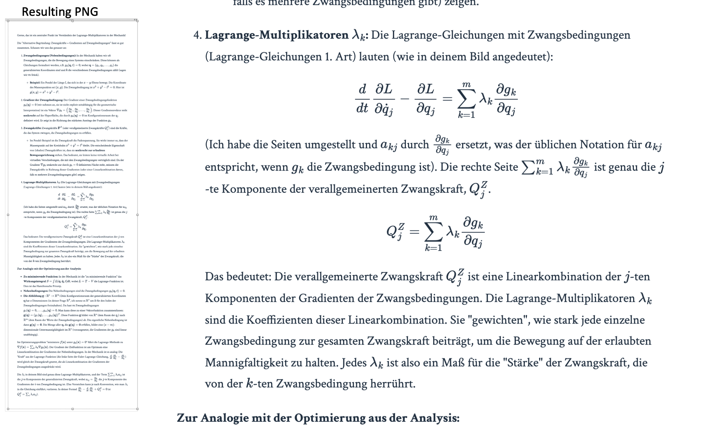

#  markdown2png (macOS)

A macOS utility to convert Markdown with LaTeX math into a high-resolution PNG and copy it directly to the clipboard. Perfect for quickly sharing beautifully typeset notes and equations from AI chats, text editors, or research notes.




### Key Features
(Currently the "save as png" button does not work, but the clipboard functionality is fully operational.)

*   **Streamlined Clipboard Workflow:** A dedicated **"Clipboard → Clipboard"** button reads Markdown from your clipboard, converts it to png, and places the resulting image back on the clipboard in one step.
*   **High-DPI Output:** Configure the resolution scale to generate crisp images perfect for Retina displays and presentations.
*   **Full Markdown & LaTeX Support:** Uses the powerful MathJax library to render both inline ($...$) and display ($$...$$) LaTeX equations beautifully.
*   **Customizable Themes:** Choose from simple themes like Academic, GitHub, or Clean to style the output.
*   **HTML Preview:** Instantly check the rendered output in your browser before generating the final image.

### How It Works

The conversion process is handled in a few simple steps:

1.  **HTML Generation:** The input Markdown is converted to a basic HTML structure. A reference to the MathJax CDN is included in the HTML header.
2.  **Headless Browser Rendering:** The application launches a headless Chromium browser instance using **Playwright**.
3.  **MathJax Processing:** The browser loads the generated HTML. The MathJax script runs, finds the LaTeX delimiters (`$` and `$$`), and typesets the equations into beautiful, readable math.
4.  **Screenshot:** Once rendering is complete, Playwright takes a high-resolution, full-page screenshot of the content.
5.  **Output:** The resulting image is either saved as a PNG file or copied directly to the macOS clipboard using an `osascript` command.

---

### Requirements

*   **macOS:** Required for the core "Copy to Clipboard" functionality.
*   **Python 3.10+:** Tested and verified on Python 3.11.10.
*   **Python Libraries:** `markdown`, `playwright`, `Pillow`.

### Installation & Usage

1.  **Clone the repository and set up the environment:**
    ```bash
    git clone https://github.com/your-username/your-repo-name.git
    cd your-repo-name
    python3 -m venv venv
    source venv/bin/activate
    ```

2.  **Install dependencies and browser files:**
    ```bash
    pip install -r requirements.txt
    playwright install chromium
    ```

3.  **Run the application:**
    ```bash
    python converter.py
    ```

---

### Building the Standalone `.app`

The included `build.sh` script uses PyInstaller to create a standalone `.app` bundle that includes the necessary Playwright browser files.

1.  Ensure you have completed all the installation steps above.
2.  Make the build script executable and run it:
    ```bash
    chmod +x build.sh
    ./build.sh
    ```
3.  The final application will be located at `dist/markdown2png.app`. You can move this to your `/Applications` folder.